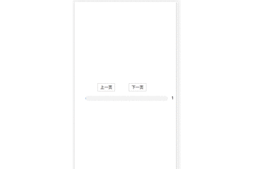

# 前言

此项目是本人开始学习jquery插件写法的试水项目，但是很有借鉴作用，主要值得学习的地方是jquery插件学习思想以及如何
搭配gulp去压缩打包一个js文件为min.js文件

# 说明

> 如果您对此项目有兴趣，可以点 “Star” 支持一下 谢谢！ ^_^
>  或者您可以 "follow" 一下，我会不断开源更多的有趣的项目

## 技术栈
jquery + gulp

## 项目运行
git clone https://github.com/codelou/preload.git

cd preload

npm install 

npm run build  (输出压缩打包后的preload代码)

# 部分截图

# 多说一句

这里给大家讲解下jquery插件开发里比较重要的两个方法，分别是：
jQuery.fn.extend();
jQuery.extend();

jQuery.fn

jQuery.fn = jQuery.prototype = {
    init:function(selector,context){}
}
原来jQuery.fn = jQuery.prototype 对prototype肯定不会陌生啦。
虽然javaScript 没有明确的类的概念，但是用类来理解它，会更方便。
jQuery便是一个封装的非常好的类，比如我们用语句$('#btn1')会生成一个jQuery类的实例。

jQuery.extend(object)
为jQuery类添加类方法，可以理解为添加静态方法。如：

jQuery.extend({
min: function(a, b) { return a < b ? a : b; },
max: function(a, b) { return a > b ? a : b; }
});
jQuery.min(2,3); //  2 
jQuery.max(4,5); //  5
Objectj Query.extend( target, object1, [objectN])
用一个或多个其他对象来扩展一个对象，返回被扩展的对象
var settings = { validate: false, limit: 5, name: "foo" }; 
var options = { validate: true, name: "bar" }; 
jQuery.extend(settings, options); 
结果：settings == { validate: true, limit: 5, name: "bar" }
jQuery.fn.extend(object);
对jQuery.prototype进得扩展，就是为jQuery类添加“成员函数”。jQuery类的实例可以使用这个“成员函数”。
比如我们要开发一个插件，做一个特殊的编辑框，当它被点击时，便alert 当前编辑框里的内容。可以这么做：
$.fn.extend({          
    alertWhileClick:function() {            
          $(this).click(function(){                 
                 alert($(this).val());           
           });           
     }       
});       
$("#input1").alertWhileClick(); // 页面上为： 

$("#input1")　为一个jQuery实例，当它调用成员方法 alertWhileClick后，便实现了扩展，每次被点击时它会先弹出目前编辑里的内容。

jQuery.extend() 的调用并不会把方法扩展到对象的实例上，引用它的方法也需要通过jQuery类来实现，如jQuery.init()，而 jQuery.fn.extend()的调用把方法扩展到了对象的prototype上，所以实例化一个jQuery对象的时候，它就具有了这些方法，这 是很重要的，在jQuery.js中到处体现这一点

jQuery.fn.extend = jQuery.prototype.extend

你可以拓展一个对象到jQuery的 prototype里去，这样的话就是插件机制了

(function( $ ){
$.fn.tooltip = function( options ) {
};
//等价于
var tooltip = {
function(options){
}
};
$.fn.extend(tooltip) = $.prototype.extend(tooltip) = $.fn.tooltip
})( jQuery );

# 或者这么理解
它们的区别其实很简单，$.extend是用来扩充jquery类属性或者方法所用 而 $.fn.extend是用来扩充jquery实例的属性或者方法所用，那什么是类属性什么又是实例属性呢？只要是静态的就是属于类级别，非静态的就是实例级别的
$.extend是用来扩充jquery类属性或者方法所用
var jsonObj1={
    			sid:'s001',
    			sname:'张三'
    	};

		var jsonObj3={
    			sid:'s002',
    			sname:'李四',
    			hobby:['a','b','c']
    	};

//用后面的对象扩充第一个对象
        $.extend(jsonObj2,jsonObj1);
 		console.log(jsonObj2);
就是后面新出来的属性会添加，存在的属性替换
$.fn.extend是用来扩充jquery实例的属性或者方法所用

也就是说，用$.extend ,则可以$.preload调用
如果用$.fn.extend ,则可以用$('#tt').preload

